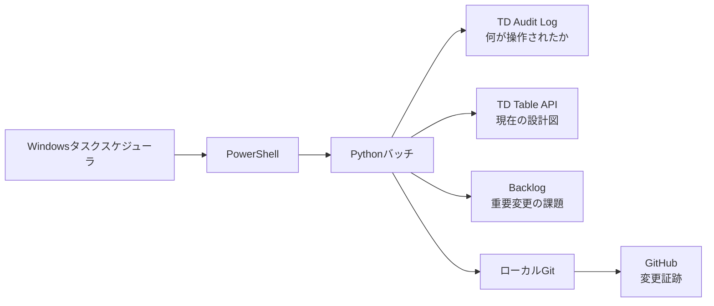
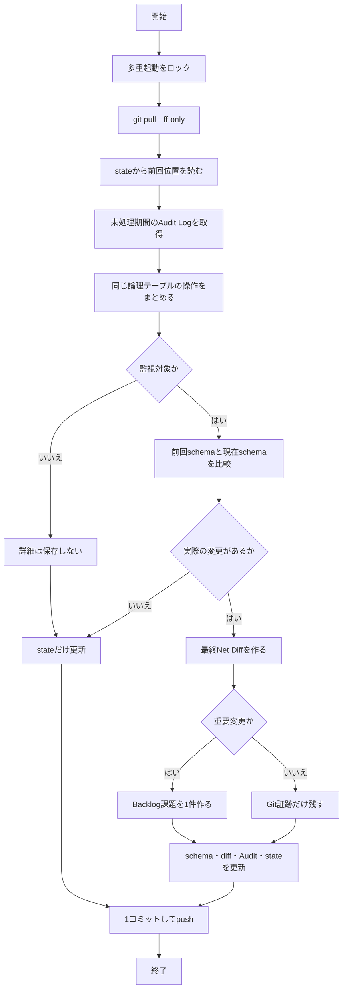
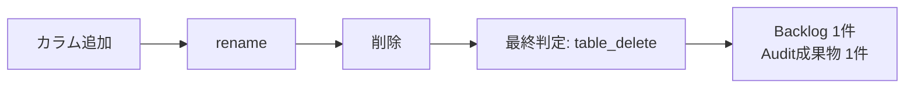
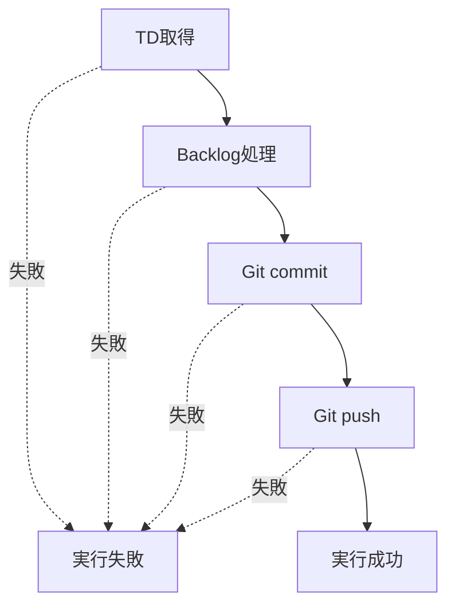

# TD Change Monitor 初心者向けシステム説明

## 何をする仕組みか

このバッチは「Treasure Dataの対象テーブルの設計図が変わったか」を1日1回確認します。テーブルの中の売上や顧客などの行データは取得・保存しません。

重要な変更があれば、あとから確認できる差分をGitHubへ残し、担当者が読めるBacklog課題をテーブルごとに1件作ります。



## 1回の処理フロー



## 「同じ論理テーブルをまとめる」とは

たとえば1日の中で、次の操作が順番に行われたとします。

```text
09:00 カラムを追加
11:00 old_table から new_table へrename
15:00 new_tableを削除
```

イベントを3件の課題にはしません。resource ID、旧名・新名、時系列を使って同じテーブルだと判断し、「最終的には削除された」という1件の課題にまとめます。本文には途中のカラム追加とrenameも操作履歴として残ります。



## 保存するもの・しないもの

| 保存する | 保存しない |
|---|---|
| 最新schema | TDテーブルの行データ |
| 実際に発生した差分 | 毎日の全テーブルsnapshot |
| 判定に使った最小Auditイベント | Audit Queryの全結果 |
| 単一state | 変更なしの日次runファイル |
| Backlog課題キーと変更ID | APIレスポンス全体・秘密情報 |

```text
schemas/current/  最新の設計図。毎回同じファイルを上書き
diffs/            人が読む変更内容。変更時だけ作成
audit_events/     根拠に使った操作。変更時だけ作成
state/state.json  次回どこから再開するかを示すしおり
logs/             PC内だけ。30日後に削除、GitHubへ送らない
```

## stateは何のためか

stateは本のしおりに相当します。前回どの時刻までAudit Logを処理したか、どのIDを処理済みにしたか、どのBacklog課題を作ったかを記録します。

PCが3日止まっても、次回はstateの続きから3日分を処理します。同じAudit Logを少し重ねて取得しますが、IDで重複を除くため二重課題を防げます。古い処理済みIDは既定7日でstateから外し、ファイルが増え続けないようにします。

## 失敗した場合



途中で失敗した実行は成功扱いしません。Backlogは`aggregated_change_id`で既存課題を確認するため、再実行しても同じ課題を重複作成しません。pushだけ失敗したローカルcommitは、次回の変更処理より先にpushを再試行します。

## 日々の確認方法

```powershell
# 書込みなしで変更候補を確認
.\scripts\run_dry_run.ps1

# 通常実行
.\scripts\run_td_change_monitor.ps1

# 保存容量を確認。削除はしない
.\scripts\check_storage.ps1
```

問題が起きたら、まずタスクスケジューラの終了結果、次に`logs/`の最新JSONログ、最後に`git status`を確認します。秘密情報やTDレコードをログへ貼り付けないでください。
